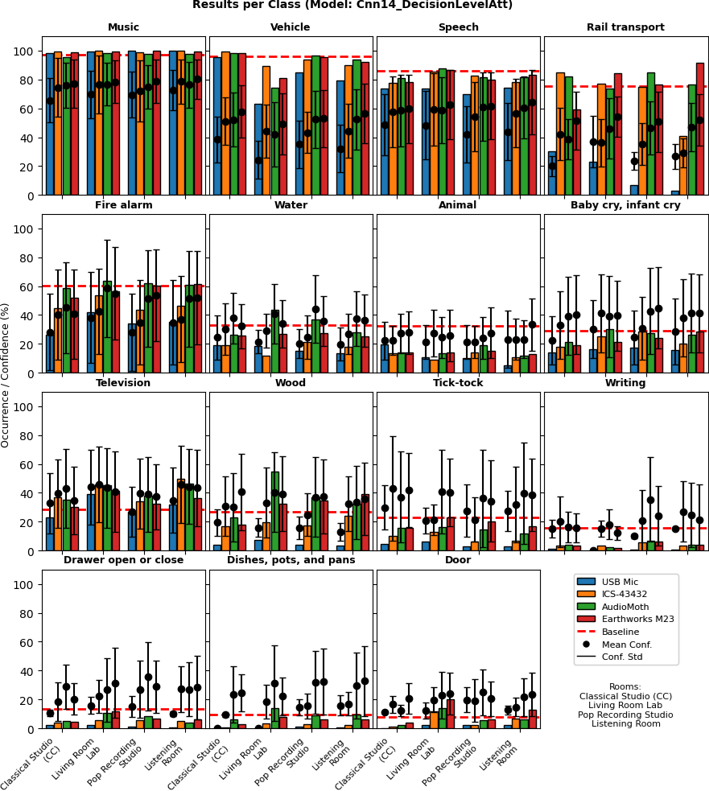
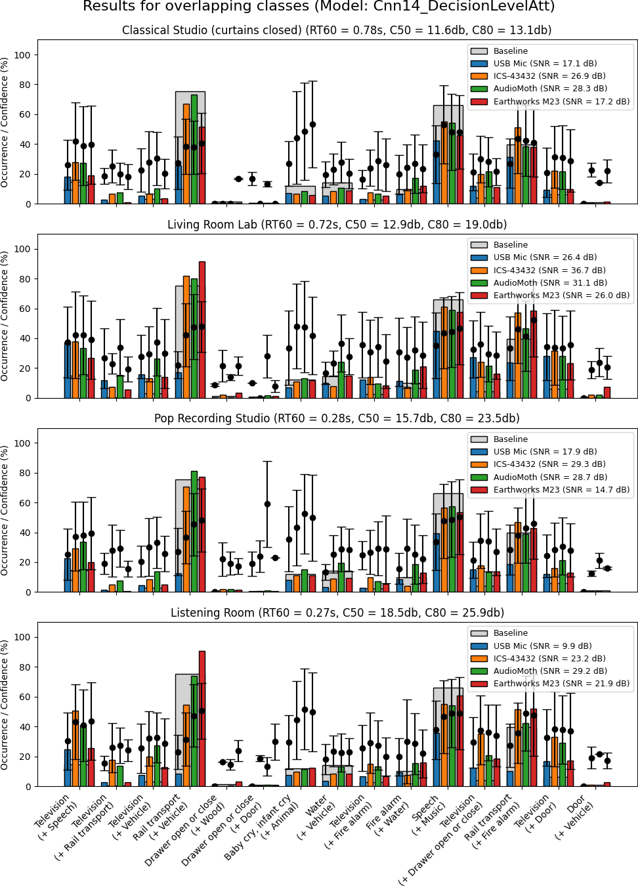
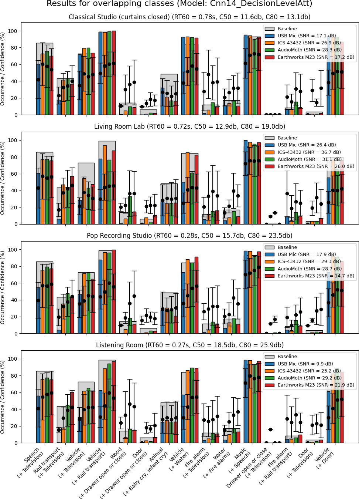

# Room Acoustics and Microphone Characteristics Show Systematic Impact on Sound Event Recognition

This repository provides all the code, data, and supplementary materials referenced in the INTER-NOISE 2025 article:

**Room Acoustics and Microphone Characteristics Show Systematic Impact on Sound Event Recognition**

Gabriel Bibbó, Craig Cieciura, Mark D. Plumbley  
Centre for Vision, Speech and Signal Processing (CVSSP), University of Surrey, United Kingdom

## Overview

This repository is a companion to the above article. It contains:

- **Audio generation code:** Scripts to generate the standardized 60-minute audio file from AudioSet, including pre-processing (normalization, compression, mixing of classes, concatenation).
- **Annotations CSV:** A CSV file containing the YouTube video IDs, timestamps, and class labels used to construct the experimental audio segments.
- **Experimental results CSV:** A CSV file with all frame-level results for every experimental configuration (room, microphone, class, etc).
- **Analysis result images:**
  - Results from the first 30 minutes (single-class segments)
  - Results from the last 30 minutes (overlapping-class segments, focusing on one class of each pair)
  - Results from the last 30 minutes (overlapping-class segments, focusing on the complementary class)

These resources enable full transparency and reproducibility of the results discussed in the article.

---

## Repository Structure

```
room_acoustics_SED/
├── code/
│   └── audio_generation/
│       ├── generate_audio.py
│       └── ...
├── data/
│   ├── annotations.csv
│   └── experiment_results.csv
├── images/
│   ├── results_single_class.png
│   ├── results_overlap_classA.png
│   └── results_overlap_classB.png
├── audio/
│   └── experiment_audio.wav
├── README.md
└── ARTICLE.pdf
```

- `code/audio_generation/`: Scripts and notebooks to generate the audio and process annotations.
- `data/annotations.csv`: Metadata for each audio segment (YouTube ID, timestamp, class label).
- `data/experiment_results.csv`: Frame-level metrics and summary statistics from all experimental runs.
- `images/results_single_class.png`: Analysis of the first 30 minutes (single classes).
- `images/results_overlap_classA.png`: Analysis of the last 30 minutes — focus on one class in overlapping pairs.
- `images/results_overlap_classB.png`: Analysis of the last 30 minutes — focus on the complementary class.
- `audio/experiment_audio.wav`: The standardized 60-minute audio stimulus used in all experiments.
- `ARTICLE.pdf`: The full article as submitted to INTER-NOISE 2025.

---

## Getting Started

1. **Clone the repository.**

   ```bash
   git clone https://github.com/gbibbo/room_acoustics_SED.git
   cd room_acoustics_SED
   ```

2. **Review the audio generation code**

   - All scripts for generating the experimental audio and processing YouTube metadata are in `code/audio_generation/`.
   - The main script is `generate_audio.py`. See comments for usage instructions.

3. **Explore the data**

   - `data/annotations.csv`: Lists every used YouTube video, the time intervals, and the mapped class label.
   - `data/experiment_results.csv`: Contains all model outputs, including frame-level occurrence, mean probability, and confidence scores for each configuration.

4. **View analysis results**

   - Visit the `images/` folder for summary figures as shown in the article:
     - `results_single_class.png`: Performance for each class, room, and microphone (first 30 mins).
     - `results_overlap_classA.png`: Overlapping classes, impact on primary class (last 30 mins).
     - `results_overlap_classB.png`: Overlapping classes, impact on complementary class.

---

## Visual Results

### Results from the first 30 minutes (single-class segments)


### Results from the last 30 minutes (overlapping-class segments, primary class)


### Results from the last 30 minutes (overlapping-class segments, complementary class)


---

## Data Description

### Audio Generation

- The audio file was generated from AudioSet segments, grouped into 15 daily household sound classes.
- Segments were normalized, compressed, and concatenated to form:
  - 30 minutes of single-class audio (2 minutes per class)
  - 30 minutes of overlapping-class audio (15 unique class pairs, 2 minutes per pair)
- See the scripts in `code/audio_generation/` for all processing details.

### Annotations

- Each 1-second segment is tracked in `data/annotations.csv` with:
  - YouTube video ID
  - Start/end timestamps
  - Assigned class(es)
  - Source information for traceability

### Experimental Results

- `data/experiment_results.csv` contains:
  - Room, microphone, class, and overlap configuration
  - Frame-level detection occurrence (%)
  - Mean probability/confidence assigned to the correct class
  - SNR measurements for each configuration

### Result Images

- Figures summarize the impact of room acoustics, microphone, and overlapping events, as described in the article:
  - `results_single_class.png`: Classes in isolation
  - `results_overlap_classA.png`: Overlaps, focus on primary class
  - `results_overlap_classB.png`: Overlaps, focus on secondary class

---

## Article Reference

If you use this repository or data, please cite:

> Bibbó, G., Cieciura, C., & Plumbley, M. D. (2025). Room Acoustics and Microphone Characteristics Show Systematic Impact on Sound Event Recognition. INTER-NOISE 2025.  
> [Link to Article](ARTICLE.pdf)

---

## License

All code and data are provided for academic/research use under a [Creative Commons Attribution (CC BY) license](https://creativecommons.org/licenses/by/4.0/).  
See `LICENSE` file for details.

---

## Contact

For questions about the code or data, please contact Gabriel Bibbó: [g.bibbo@surrey.ac.uk](mailto:g.bibbo@surrey.ac.uk)

---
